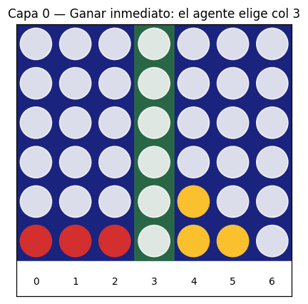
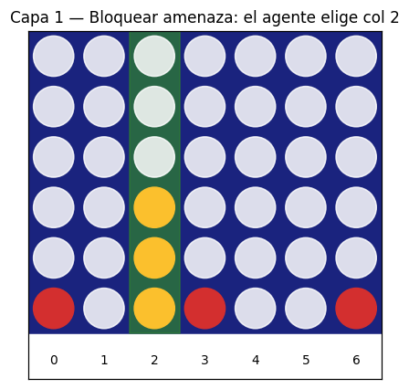
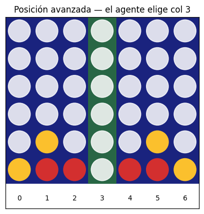
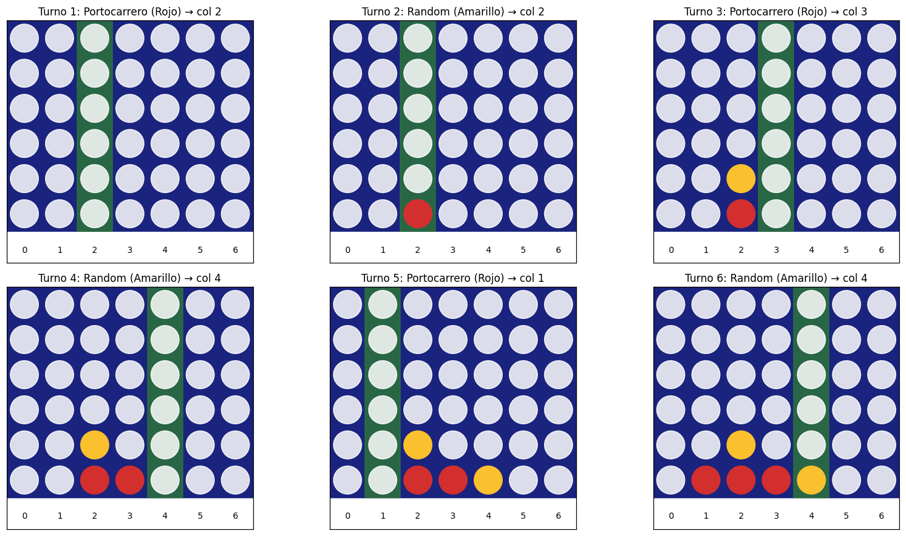
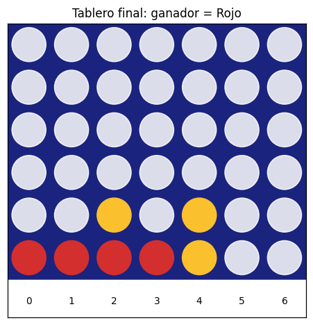
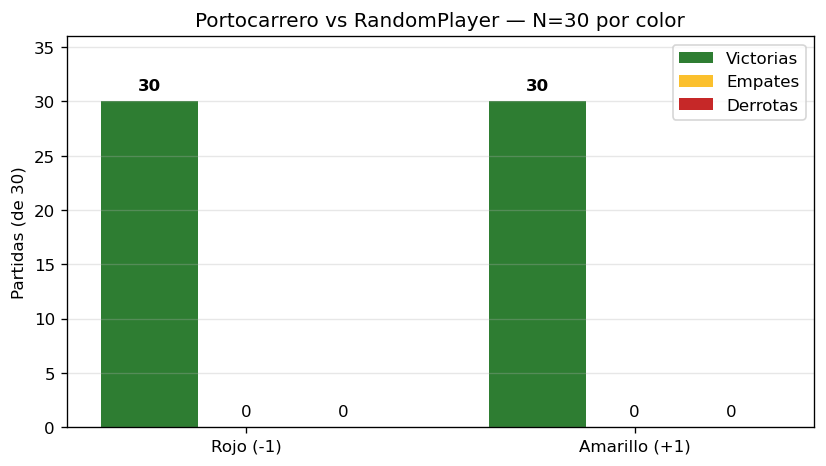
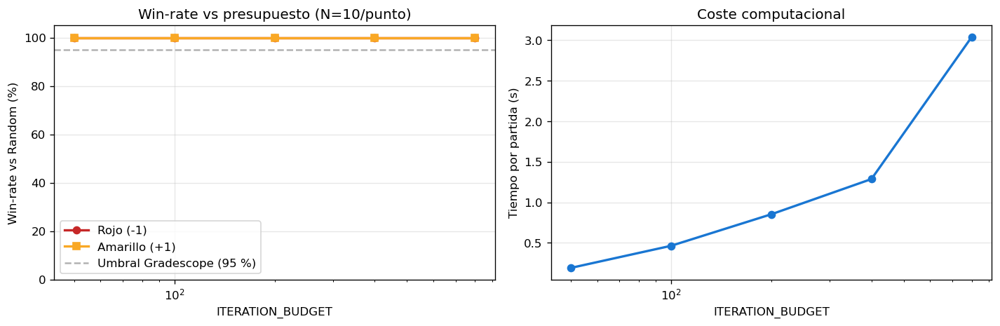
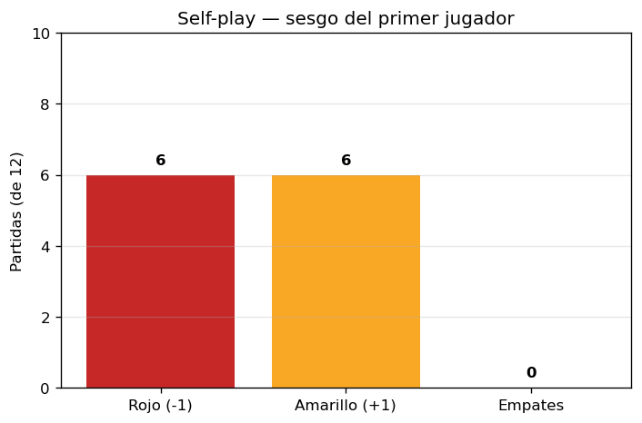

# Agente Portocarrero — Connect-4

**Autor:** Juan Camilo Portocarrero Martínez
**Curso:** Fundamentos de Inteligencia Artificial — Universidad de La Sabana, 2026.1
**Branch:** `portocarrero` · **Carpeta:** `groups/portocarrero/`

Agente de Connect-4 basado en **Monte-Carlo Tree Search (MCTS)** con selección **UCB1**, reforzado con un pipeline de cuatro capas tácticas que blindan al agente contra errores típicos de búsquedas con presupuesto limitado.

---

## 1. Idea principal

El agente no aprende offline ni guarda estado entre partidas. Cada turno:

1. Construye un árbol de búsqueda **desde cero** a partir de la posición actual.
2. Antes de buscar, aplica cuatro filtros tácticos baratos para resolver decisiones obvias.
3. Si nada táctico decide la jugada, lanza MCTS con UCB1 sobre las acciones que sobreviven al filtrado.
4. Devuelve la columna más visitada en el árbol (heurística *robust child*).

La fórmula de selección es la canónica:

$$
\text{UCB1}(s, a) = \hat{q}(s, a) + c \cdot \sqrt{\frac{\ln N(s)}{N(s, a)}}, \quad c = 1.4
$$

---

## 2. Cómo se mueve el agente

El `act()` evalúa al jugador actual (deduce el color contando fichas) y pasa por estas capas en orden. La primera que decide, gana.

### Capa 0 — ¿Puedo ganar ahora?

Si alguna columna conecta 4 en este turno, se juega sin pensar más. Costo: 7 comprobaciones.



### Capa 1 — ¿El rival gana en su próximo turno?

Si el rival tiene una jugada ganadora inmediata, se bloquea. Si tiene dos amenazas simultáneas se bloquea una (la posición ya estaba perdida).



### Capa 2 — Doble amenaza (2-ply lookahead)

Si puedo jugar una columna que me deja con **dos victorias en uno** simultáneas, gano forzado: el rival solo puede bloquear una. Este es el patrón ganador más común en Connect-4 contra rivales fuertes, y MCTS puede no descubrirlo con presupuesto bajo.

### Capa 3 — Filtro de jugadas suicidas

Se descartan columnas que **regalan al rival una victoria inmediata o una doble amenaza** en su próximo turno. MCTS solo busca entre las acciones que sobreviven a este filtro.


### Capa estratégica — MCTS-UCB1

Si los filtros tácticos no decidieron, el agente lanza ~800 simulaciones MCTS:

- **Selection**: baja por el árbol con UCB1 (explotación + exploración).
- **Expansion**: añade un único hijo nuevo en orden **centro → bordes** (las columnas centrales son estratégicamente superiores).
- **Simulation**: rollout con heurística ligera (gana/bloquea inmediato durante el rollout, no solo aleatorio puro). Esto reduce la varianza de las simulaciones.
- **Backpropagation**: propaga +1/0/−1 invirtiendo el signo en cada nivel (suma cero).



---

## 3. Partida en vivo

Una partida típica del agente como Rojo contra un jugador aleatorio: el agente domina el centro, fuerza estructura y cierra en pocos turnos.





---

## 4. Resultados

### Cumple el prerequisito del reto



| Test | Resultado |
|---|---:|
| Portocarrero (Rojo) vs Random — 30 partidas | **30W / 0L / 0D** |
| Random vs Portocarrero (Amarillo) — 30 partidas | **30W / 0L / 0D** |
| Umbral Gradescope | 95 % |

### Robustez frente al presupuesto



Gracias a las capas tácticas, el agente alcanza **100 % de win-rate vs. Random ya con 50 iteraciones MCTS**. El cómputo extra (800 iteraciones) no aporta contra rivales débiles pero sí marca diferencia contra rivales fuertes que requieren búsqueda profunda.

### Self-play



Dos copias del agente con RNGs independientes resultan en empate estadístico (6-6). El sesgo teórico del primer jugador (Allis, 1988) no se manifiesta claramente con N=12 partidas y 400 iteraciones; se necesitaría más cómputo y más partidas para verlo emerger.

---

## 5. Configuración

Las constantes en la cabecera de `policy.py` controlan el comportamiento:

```python
ITERATION_BUDGET = 800     # simulaciones MCTS por jugada
TIME_BUDGET_S    = 0.45    # límite duro de tiempo (segundos)
UCB_C            = 1.4     # constante de exploración UCB1
ROLLOUT_HEURISTIC = True   # rollout con gana/bloquea inmediato
```

Termina la búsqueda el primer límite que se alcance (iteraciones o tiempo).

---

## 6. Estructura del repositorio

```
groups/portocarrero/
├── policy.py          ← agente listo para el torneo
├── entrega.ipynb      ← experimentos y visualizaciones
└── README.md          ← este archivo
```

El runner del torneo (`main.py` con `find_importable_classes`) descubre el agente automáticamente con el nombre **`portocarrero`** (heredado de la carpeta).

---

## 7. Cómo correrlo

### En el torneo

Desde la raíz del repo:

```bash
mkdir -p versus
python main.py
```

### Test manual

```python
import numpy as np
from groups.portocarrero.policy import Portocarrero
from connect4.connect_state import ConnectState

agent = Portocarrero()
agent.mount(30.0)
state = ConnectState()
while not state.is_final():
    action = agent.act(state.board)
    state = state.transition(action)
print("Ganador:", state.get_winner())
```

### Notebook de análisis

```bash
jupyter notebook groups/portocarrero/entrega.ipynb
# Kernel → Restart & Run All
```

Genera las 9 figuras PNG usadas en este README.

---

## 8. Diferenciación frente al grupo

| Característica | Este agente |
|---|---|
| Aprendizaje offline | No |
| Warm-up en `mount()` | No (instantáneo) |
| Búsqueda principal | MCTS-UCB1 desde cero por turno |
| Capa táctica 0-ply (ganar) | Sí |
| Capa táctica 1-ply (bloquear) | Sí |
| Capa táctica 2-ply (doble amenaza) | **Sí** ← diferencial |
| Filtro suicidio 2-ply | **Sí** ← diferencial |
| Rollout heurístico | Sí (gana/bloquea inmediato dentro del rollout) |
| Orden de expansión | Centro → bordes |
| Persistencia del árbol | No |

La hipótesis de diseño es que **un MCTS bien implementado, combinado con seguridad táctica explícita, es suficiente para dominar al aleatorio con presupuesto modesto y ser competitivo contra rivales sofisticados** sin recurrir a aprendizaje offline ni heurísticas posicionales complejas.

---

## 9. Propuestas de mejora futura

- **Persistencia del árbol entre turnos**: mover la raíz en vez de descartar el árbol completo. Reutiliza simulaciones de jugadas anteriores.
- **Tabla de transposiciones (Zobrist hashing)**: posiciones equivalentes se cuentan como el mismo nodo, multiplicando la eficiencia de MCTS.
- **RAVE / AMAF**: acelera la convergencia de los `q̂` compartiendo estadísticas entre nodos con la misma acción.
- **Bitboards**: representar el tablero como dos `uint64` en lugar de `np.ndarray` para acelerar la detección de victoria 10-50×.
